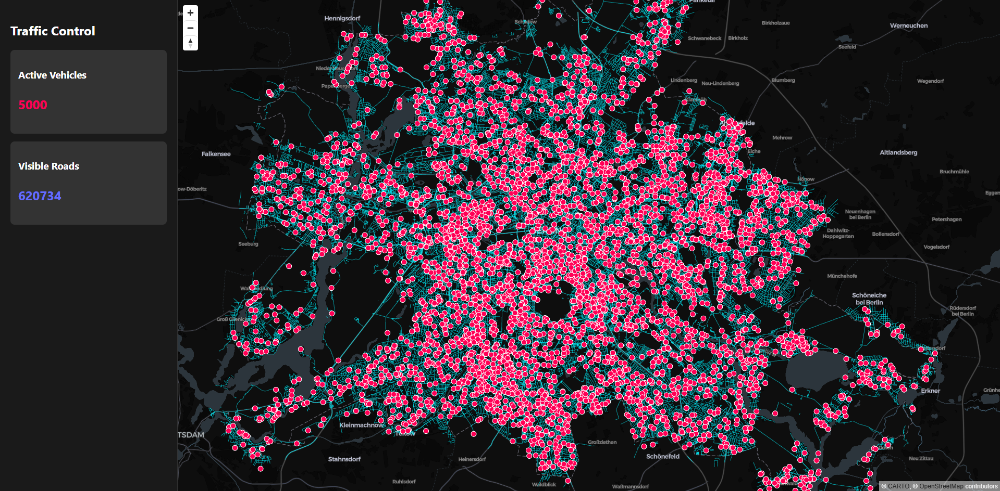
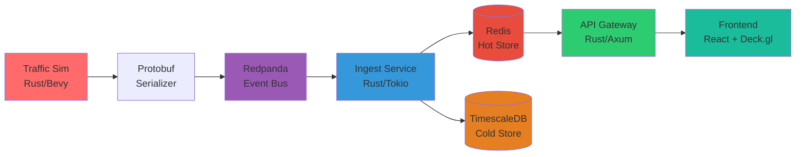

#  Traffic Control Tower: Distributed City Simulation


-orange?logo=rust&style=flat-square)


> **A high-performance, event-driven distributed system simulating massive urban traffic in real-time.**

This project simulates **5,000+ autonomous agents** navigating the Berlin road network (600k+ segments) at **60 FPS**. It demonstrates a production-grade architecture using Rust, Kafka, and WebGL to solve high-frequency data ingestion and visualization challenges.

---

##  Visualization


*(Real-time visualization of 5,000 agents in Berlin using Deck.gl)*

---

##  System Architecture

The system implements a **Lambda Architecture** pipeline, separating the **Hot Path** (real-time visualization) from the **Cold Path** (historical storage).



### Core Components

| Component | Technology | Description |
|-----------|-----------|-------------|
| **Traffic Sim** | Rust, Bevy ECS | The heartbeat of the system. Parses OSM PBF maps, builds a routing graph, and simulates physics for thousands of entities in parallel. |
| **Event Bus** | Redpanda | A high-throughput streaming platform (Kafka API) buffering telemetry between simulation and ingestion. |
| **Ingest Service** | Rust, Tokio | Consumes the Kafka stream. Updates geospatial indexes in Redis (Hot Path) and batches data into TimescaleDB (Cold Path). |
| **API Gateway** | Rust, Axum | Serves map geometry and establishes WebSocket connections to stream vehicle positions to clients. |
| **Frontend** | React, Deck.gl | A WebGL-powered dashboard capable of rendering tens of thousands of moving points and map geometries smoothly on the GPU. |

---

##  Engineering Challenges & Solutions

### 1. The Rendering Bottleneck (DOM vs. GPU)

**Challenge:** Early prototypes using Leaflet (DOM-based rendering) crashed the browser at ~500 entities. The DOM could not handle high-frequency updates.

**Solution:** Migrated to **Deck.gl**. By utilizing WebGL, the rendering load was offloaded to the GPU. The system now renders 5,000+ vehicles and 600,000 road segments at a stable 60 FPS.

### 2. Data Throughput & Serialization

**Challenge:** Streaming JSON telemetry for thousands of agents generated massive CPU overhead (serialization) and network saturation.

**Solution:** Implemented **Protocol Buffers** (gRPC style). Telemetry messages were compacted into binary format, reducing payload size by ~70% and drastically improving ingestion throughput.

### 3. Real-time Smoothness vs. Latency

**Challenge:** Network packets arrive discretely (tick rate), causing "jittery" movement on the client side.

**Solution:** Implemented a **Linear Interpolation Buffer** on the frontend. The client renders the state slightly in the past (50-100ms), interpolating between the last two known server snapshots for fluid motion.

### 4. Docker Build Optimization

**Challenge:** Rust compilation times for 3 microservices were exceeding 10 minutes; images were 2GB+.

**Solution:** Implemented **Multi-Stage Docker Builds**. The final images use `debian-slim`, contain only compiled binaries, and weigh under 100MB. Build caching is leveraged for dependencies.

---

##  Quick Start (Clone & Run)

The entire system is fully containerized. No local Rust/Node.js installation required.

### Prerequisites

- Docker & Docker Compose

### Installation

1. Clone the repository:
```bash
git clone https://github.com/hlibstrochkovskyi/traffic-control-tower.git
cd traffic-control-tower
```

2. Start the environment:
```bash
docker-compose up --build
```

> **Note:** The first build may take a few minutes to compile the Rust crates.

3. Access the Dashboard:

Open your browser at `http://localhost`

---

##  Project Structure

```
traffic-control-tower/
├── crates/                 # Rust Microservices (Monorepo)
│   ├── traffic-sim/        # Simulation Engine (Bevy ECS)
│   ├── traffic-ingest/     # Data Processor (Kafka -> DB)
│   ├── traffic-api/        # API Gateway (Axum)
│   └── common/             # Shared libs, Map Parser, Proto definitions
├── frontend/               # React + Deck.gl Application
├── proto/                  # Protobuf definitions
├── docker-compose.yml      # Orchestration
└── Dockerfile              # Unified Backend Dockerfile
```

---

##  Technology Stack

### Backend
- **Rust** - Systems programming language for high performance
- **Bevy ECS** - Entity Component System for parallel simulation
- **Axum** - Modern web framework for API services
- **Tokio** - Async runtime for concurrent operations
- **Protocol Buffers** - Efficient binary serialization

### Infrastructure
- **Redpanda** - Kafka-compatible streaming platform
- **Redis** - In-memory data store for real-time geospatial data
- **TimescaleDB** - Time-series database for historical analytics
- **Docker** - Containerization and orchestration

### Frontend
- **React** - UI framework
- **Deck.gl** - WebGL-powered visualization library
- **Vite** - Fast build tool and dev server
- **TypeScript** - Type-safe JavaScript

---

##  Future Roadmap

- [ ] **A* Pathfinding:** Implement dynamic routing for agents (currently random graph walks)
- [ ] **Smart Traffic Lights:** Integrate traffic signal logic into the ECS based on intersection density
- [ ] **Analytics Dashboard:** Visualize average speeds and congestion zones using Grafana connected to TimescaleDB
- [ ] **Multi-City Support:** Add support for other major cities beyond Berlin
- [ ] **Machine Learning:** Train ML models to predict traffic patterns and optimize routes
- [ ] **3D Visualization:** Upgrade to 3D building rendering for enhanced realism

---

##  Performance Metrics

- **Simulation Rate:** 60 FPS with 5,000+ agents
- **Data Throughput:** ~10,000 messages/second via Kafka
- **Latency:** <100ms end-to-end (simulation → client)
- **Memory Footprint:** ~200MB per microservice
- **Docker Image Size:** <100MB per service

---

##  Contributing

Contributions are welcome! Please feel free to submit a Pull Request.

---

##  License

This project is licensed under the MIT License - see the LICENSE file for details.

---

##  Author

**Hlib Strochkovskyi**

- GitHub: [@hlibstrochkovskyi](https://github.com/hlibstrochkovskyi)

---

##  Acknowledgments

- OpenStreetMap for map data
- Bevy community for the excellent ECS framework
- Deck.gl team for the powerful visualization library

---

**⭐ If you found this project interesting, please consider giving it a star!**
